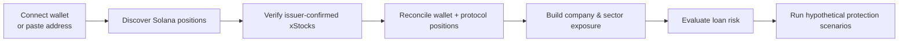
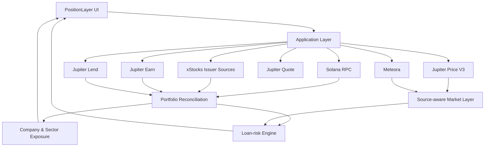

  

<h1 align="center">PositionLayer</h1>

<h3 align="center">When Wall Street closes, your loan doesn't.</h3>

  <strong>A read-only Solana workspace for tokenized-stock portfolios, lending exposure, and loan-risk analysis.</strong>

  Connect a Solana wallet or paste any public address to understand xStocks, collateral, debt, portfolio exposure, liquidity, and hypothetical protection plans in one reconciled view.

  <strong>Live deployment and demo links will be added after host verification.</strong>
  &nbsp;•&nbsp;
  <a href="docs/PRODUCT_GUIDE.md"><strong>Product Guide</strong></a>
  &nbsp;•&nbsp;
  <a href="docs/METHODOLOGY.md"><strong>Methodology</strong></a>

  
  
  
  

---

## Overview

PositionLayer is a **read-only analytical workspace for tokenized stocks on Solana**.

Instead of showing only a raw token list, it helps users understand:

- what they hold
- where their exposure comes from
- how lending positions are structured
- how risky a stock-backed loan may become
- what hypothetical repayment could move a loan toward a selected target LTV

> **See the position. Understand the exposure. Model the risk.**

---

## The Problem

Tokenized stocks become more powerful when they are used across wallets, lending, liquidity, and portfolio workflows.

But that also makes a position harder to understand.

A single wallet may contain:

- direct xStock holdings
- xStocks posted as collateral
- borrowed USDC
- Jupiter Earn positions
- Jupiter Lend positions
- ETF-based indirect company exposure
- receipt or accounting tokens
- indexed records that should not be counted as additional portfolio value

The important question is no longer just:

> **What tokens are in this wallet?**

It becomes:

> **What do I actually own, where is my exposure, how risky is my loan, and what happens if the underlying stock moves?**

PositionLayer brings those pieces together in one workspace.

---

## Product Workspaces

| Workspace | What it helps answer |
| --- | --- |
| **Overview** | Covered value, free USDC, debt, net equity, highest-risk loan, and largest company exposure |
| **Stocks** | Issuer-confirmed Solana xStocks with market observations, liquidity information, and source-backed details |
| **Portfolio** | Wallet holdings, collateral, Earn, borrow, indexed, and excluded positions in one reconciled view |
| **Exposure** | Direct and indirect company/sector exposure, including verified ETF look-through |
| **Protect** | Hypothetical stock shocks, resulting loan risk, and repayment toward a target LTV |

> **Stocks works without connecting a wallet.**

### Canonical catalog preview

The Stocks workspace also has an opt-in **Canonical preview**. It keeps reviewed and live issuer-confirmed Solana mints searchable instead of stopping at the current market's 300-mint display set. It reports unique mints, actual Jupiter Price V3 observations, freshness, failed/omitted batches, and source coverage separately. A mint in the catalog is **not** a promise of a live price or a verified U.S. equity classification. Unpriced entries remain visible; the preview leads with observed token prices when available. The approved **Current market** view remains one-click rollback.

Canonical prices come from a single, paced, server-side writer on a continuously running Node process. Website requests only read a completed snapshot; on a cold start or market-host outage, the reviewed catalog remains searchable without inventing prices. A Vercel deployment must point its server-only reader at that persistent writer; enabling the writer inside Vercel Functions is not a supported deployment. See [hosting and release](docs/HOSTING_AND_RELEASE.md) for exact variables, validation, and limitations. The preview's covered Solana tokenized cap and original company cap remain unavailable without qualifying supply/company evidence; they are never derived from an unrelated reported token cap.

---

## How PositionLayer Works

PositionLayer follows one core rule:

**Portfolio value, market pricing, protocol accounting, and exposure are related — but they should never be silently treated as the same thing.**

---

## Why PositionLayer Is Different

### Exact xStock verification

PositionLayer does not rely on token names or symbols alone.

Issuer-confirmed Solana mint addresses are used to distinguish supported xStocks from unrelated assets with similar naming.

### Source-aware market data

The selected market observation comes from **Jupiter Price V3**.

Issuer marks and Meteora pool observations keep their own labels and do not silently replace the selected market price.

Missing or stale observations remain visibly unavailable rather than being replaced with synthetic zero values.

### Protocol-aware loan risk

Public market prices and protocol loan accounting are not interchangeable.

PositionLayer keeps protocol LTV and oracle accounting separate from public market observations.

If required risk inputs are stale, invalid, or unsupported, the affected calculation fails closed.

### Portfolio reconciliation

PositionLayer separates:

- wallet holdings
- posted collateral
- borrowed assets
- Earn underlying assets
- receipt/accounting tokens
- indexed comparison records
- excluded assets

> **One economic position should not quietly become two portfolio positions.**

### Company and sector exposure

PositionLayer groups supported positions by company and sector and supports verified ETF look-through where source data is available.

### Hypothetical protection planning

The Protect workspace models hypothetical stock-price shocks and their effect on loan LTV.

It can estimate the USDC repayment associated with moving a position toward a selected target LTV.

It does **not** create, sign, or submit transactions.

---

## Built for Solana

PositionLayer uses Solana as the common portfolio and settlement layer connecting tokenized stocks with lending and liquidity.

| Integration | Role in PositionLayer |
| --- | --- |
| **Solana RPC** | Wallet balances, token accounts, mint-level discovery, and on-chain state |
| **Solana Wallet Standard** | Wallet connection for read-only public-address analysis |
| **xStocks issuer data** | Exact supported-mint verification and issuer-backed metadata |
| **Jupiter Price V3** | Selected public market-price observations |
| **Jupiter Earn** | Read-only Earn position discovery |
| **Jupiter Lend** | Lending, borrowing, collateral, and protocol-risk data |
| **Jupiter Quote** | User-triggered quote-only liquidity checks |
| **Meteora** | Separate liquidity and pool observations where available |

No integration is allowed to silently redefine another provider's data.

---

## Read-Only by Design

PositionLayer intentionally has **no transaction execution path**.

It does not:

- request private keys
- request seed phrases
- construct transactions
- sign transactions
- submit transactions
- execute swaps
- execute repayments
- move user funds
- automatically rebalance positions
- automatically protect a loan

A Jupiter liquidity check is a **quote-only read** initiated by the user. It is not an order.

---

## Explore PositionLayer

### Live Wallet

Connect a compatible Solana Wallet Standard wallet.

Only the wallet's public address is used for analysis.

### Public Address

Paste any public Solana address and inspect supported positions without connecting a wallet.

### Sample

Open the built-in sample portfolio to explore the product without using a real address.

Sample data is loaded only when **Sample** is explicitly selected.

---

## Stocks Without a Wallet

The Stocks workspace is independent from wallet state.

It can be used to explore the supported tokenized-stock universe, including:

- issuer identity
- exact Solana mint
- market observation
- observation age
- liquidity information
- source labels
- supported metadata

---

## Data Integrity Principles

**Identity before symbol**  
Assets are matched by exact mint where required.

**Unavailable is better than fake precision**  
Missing data remains missing.

**Price source stays visible**  
Different observations retain different source labels.

**Protocol accounting stays protocol accounting**  
Public market prices do not silently replace loan-oracle inputs.

**One economic position is counted once**  
Receipt tokens and indexed records are reconciled before totals are produced.

**Stale risk inputs fail closed**  
Unsupported, invalid, or stale risk data is not presented as a trustworthy calculation.

---

## Architecture

---

## Documentation

| Document | Purpose |
| --- | --- |
| [`PRODUCT_GUIDE.md`](docs/PRODUCT_GUIDE.md) | Full product behavior and workspace guide |
| [`METHODOLOGY.md`](docs/METHODOLOGY.md) | Data sources, reconciliation rules, calculations, assumptions, and limitations |
| [`HOSTING_AND_RELEASE.md`](docs/HOSTING_AND_RELEASE.md) | Development, environment, hosting, deployment, and release instructions |

Technical setup is intentionally kept outside the main README so this page stays focused on the product.

---

## Built for Stocklana

PositionLayer was built for the **Stocklana — Stocks on Solana Hackathon**.

The project explores what happens when tokenized stocks stop being isolated wallet assets and become part of a broader on-chain portfolio, lending, liquidity, and risk environment.

Rather than building another trading interface, PositionLayer focuses on the layer **after ownership**:

> **Understanding the position itself.**

---

## Current Scope

PositionLayer currently focuses on:

- tokenized stocks on Solana
- portfolio reconciliation
- Jupiter Earn and Lend visibility
- stock-backed loan-risk analysis
- company and sector exposure
- ETF look-through where verified data is available
- public stock discovery
- quote-only liquidity checks
- hypothetical protection planning

### Coming Later

**Market Analysis** is reserved for a future release and is intentionally disabled in the current navigation.

---

## Disclaimer

PositionLayer is an analytical prototype.

It is **not**:

- investment advice
- a brokerage
- a trading system
- an automated monitoring guarantee
- a liquidation-prevention service
- a guarantee of data availability or accuracy

Market, issuer, protocol, and liquidity information depends on the availability and quality of the named providers.

Users should independently verify important financial information before acting on it.

---

  

<h3 align="center">PositionLayer</h3>

  <strong>See the position. Understand the exposure. Model the risk.</strong>

  <a href="YOUR_LIVE_APP_URL"><strong>Live App</strong></a>
  &nbsp;•&nbsp;
  <a href="YOUR_YOUTUBE_DEMO_URL"><strong>Demo Video</strong></a>
  &nbsp;•&nbsp;
  <a href="docs/PRODUCT_GUIDE.md"><strong>Product Guide</strong></a>

